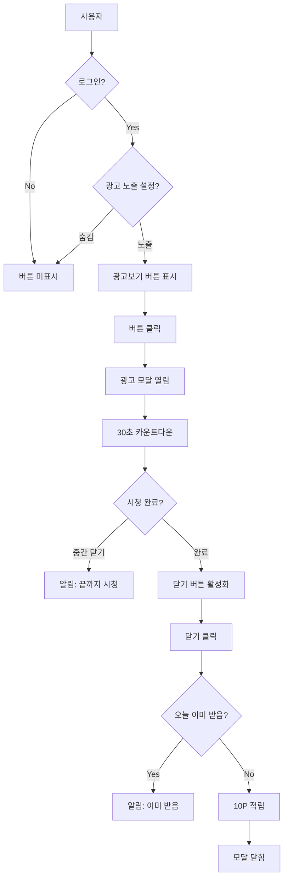
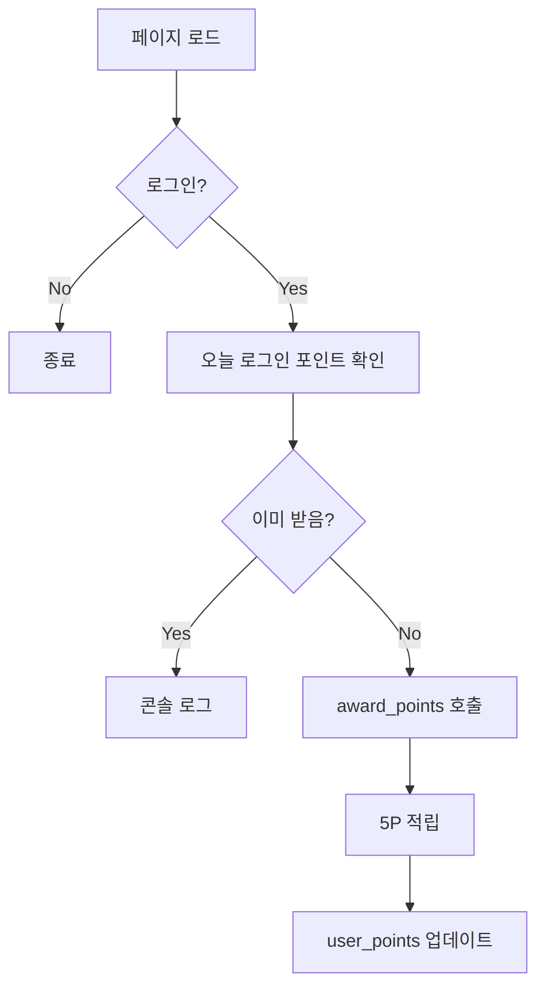

# 📺 광고 시청 & 일일 로그인 포인트 시스템 가이드

## 📋 목차
1. [개요](#개요)
2. [주요 기능](#주요-기능)
3. [데이터베이스 구조](#데이터베이스-구조)
4. [포인트 정책](#포인트-정책)
5. [구현 상세](#구현-상세)
6. [사용 방법](#사용-방법)
7. [버그 방지 전략](#버그-방지-전략)

---

## 개요

복비까비 서비스에 **광고 시청**과 **일일 로그인** 포인트 적립 기능이 추가되었습니다.

### 주요 특징
- ✅ 광고 시청 완료 시 **10P** 적립 (하루 1회)
- ✅ 일일 로그인 시 **5P** 자동 적립 (하루 1회)
- ✅ 중복 적립 방지 (날짜 기반 체크)
- ✅ 관리자 설정으로 광고 노출 ON/OFF 가능
- ✅ 30초 광고 시청 후 포인트 지급

---

## 주요 기능

### 1. 콘텐츠 노출 관리 (시스템 관리)

#### 위치
```
시스템 관리 → 콘텐츠 노출 관리
```

#### 설정 항목
- **광고 노출**: 사이드바에 "광고보기" 버튼 표시 여부
  - 노출: 사용자에게 광고보기 버튼 표시
  - 숨김: 광고보기 버튼 숨김
- **서베이 노출**: 사이드바에 "서베이" 버튼 표시 여부

#### 데이터베이스
```sql
-- common_code_detail 테이블
code_group: 'SYSTEM_CONFIG'
code_value: 'ADVERTISEMENT_VISIBLE'
code_name: '광고 노출'
description: 'Y:노출,N:숨김'
```

### 2. 광고보기 버튼 (사이드바)

#### 표시 조건
- 관리자가 "광고 노출"을 "노출"로 설정한 경우
- 로그인한 사용자에게만 표시

#### UI
```
📺 광고보기 (10P 적립)
```

#### 동작
1. 버튼 클릭 → 광고 모달 열림
2. 30초 광고 시청 (카운트다운)
3. 시청 완료 → "닫기 (10P 받기)" 버튼 활성화
4. 닫기 버튼 클릭 → 10P 적립 + 모달 닫힘

### 3. 광고 모달 (AdModal)

#### 구성 요소
- **헤더**: 제목 + 닫기 버튼 (시청 완료 후에만 표시)
- **광고 영역**: 실제 광고 콘텐츠 (추후 애드센스 등 연동)
- **카운트다운**: 남은 시간 표시 (30초 → 0초)
- **완료 메시지**: "시청 완료! 닫기 버튼을 눌러주세요."
- **안내**: "광고를 끝까지 시청하면 10P가 적립됩니다! (하루 1회)"

#### 중요 로직
```typescript
// 중간에 닫기 방지
const handleClose = async () => {
  if (!canClose) {
    alert('광고를 끝까지 시청해주세요!')
    return
  }
  // 포인트 적립 로직...
}
```

### 4. 일일 로그인 포인트

#### 적립 시점
- 사용자가 메인 페이지(`app/page.tsx`)에 접속할 때
- `useEffect` 훅으로 자동 실행

#### 적립 조건
- 로그인한 사용자
- 오늘 아직 로그인 포인트를 받지 않은 경우

#### 로직
```typescript
useEffect(() => {
  const awardDailyLoginPoints = async () => {
    // 1. 세션 확인
    // 2. 오늘 이미 받았는지 확인
    // 3. 받지 않았으면 award_points 함수 호출
  }
  awardDailyLoginPoints()
}, [])
```

---

## 데이터베이스 구조

### 1. 포인트 정책 (common_code_detail)

```sql
-- DAILY_LOGIN: 일일 로그인 5P
INSERT INTO common_code_detail (code_group, code_value, code_name, description, sort_order, use_yn, sta_ymd, end_ymd)
VALUES ('POINT_POLICY', 'DAILY_LOGIN', '5', '일일 로그인', 6, 'Y', '20240101', '99991231');

-- AD_VIEW: 광고 시청 10P
INSERT INTO common_code_detail (code_group, code_value, code_name, description, sort_order, use_yn, sta_ymd, end_ymd)
VALUES ('POINT_POLICY', 'AD_VIEW', '10', '광고 시청', 7, 'Y', '20240101', '99991231');
```

### 2. 포인트 거래 내역 (point_transactions)

```sql
-- 일일 로그인 기록
{
  supabase_user_id: 'user-uuid',
  transaction_type: 'DAILY_LOGIN',
  points: 5,
  description: '일일 로그인 보상',
  created_at: '2026-02-05T09:00:00'
}

-- 광고 시청 기록
{
  supabase_user_id: 'user-uuid',
  transaction_type: 'AD_VIEW',
  points: 10,
  description: '광고 시청 완료',
  created_at: '2026-02-05T14:30:00'
}
```

### 3. 사용자 포인트 (user_points)

```sql
{
  supabase_user_id: 'user-uuid',
  total_points: 215,  -- 자동 업데이트 (트리거)
  updated_at: '2026-02-05T14:30:00'
}
```

---

## 포인트 정책

### 전체 포인트 정책 목록

| 액션 | 코드 | 포인트 | 제한 | 설명 |
|------|------|--------|------|------|
| 출석 체크 | ATTENDANCE | 10P | 1일 1회 | 매일 출석 |
| 계약서 등록 | CONTRACT | 100P | 제한 없음 | 계약서 등록 |
| 서베이 완료 | SURVEY | 50P | 1회 | 서베이 응답 |
| 리뷰 작성 | REVIEW | 200P | 월 3회 | 리뷰 작성 |
| 관심 등록 | FAVORITE | 5P | 제한 없음 | 관심 부동산 등록 |
| **일일 로그인** | **DAILY_LOGIN** | **5P** | **1일 1회** | **자동 적립** |
| **광고 시청** | **AD_VIEW** | **10P** | **1일 1회** | **30초 시청** |

---

## 구현 상세

### 1. 파일 구조

```
components/
├── AdModal.tsx              # 광고 모달 컴포넌트
├── AdModal.module.css       # 광고 모달 스타일
├── Sidebar.tsx              # 광고보기 버튼 추가
└── Header.tsx               # 콘텐츠 노출 관리 UI

app/
└── page.tsx                 # 일일 로그인 포인트 로직

supabase/migrations/
├── create_survey_and_point_system.sql  # 포인트 정책 추가
└── add_content_visibility_config.sql   # 광고 노출 설정
```

### 2. 광고 시청 플로우



### 3. 일일 로그인 플로우



### 4. 중복 방지 로직

#### 날짜 기반 체크
```typescript
const today = new Date().toISOString().split('T')[0]  // '2026-02-05'

const { data: existingTransaction } = await supabase
  .from('point_transactions')
  .select('id')
  .eq('supabase_user_id', session.user.id)
  .eq('transaction_type', 'DAILY_LOGIN')  // 또는 'AD_VIEW'
  .gte('created_at', `${today}T00:00:00`)  // 오늘 00:00:00 이후
  .lte('created_at', `${today}T23:59:59`)  // 오늘 23:59:59 이전
  .maybeSingle()

if (existingTransaction) {
  // 이미 받았음
  return
}
```

#### 트랜잭션 안전성
```sql
-- award_points 함수는 트랜잭션 내에서 실행됨
BEGIN
  -- 1. point_transactions 삽입
  -- 2. user_points 업데이트 (트리거 자동)
COMMIT
```

---

## 사용 방법

### 1. 데이터베이스 설정

#### SQL 실행
```bash
# Supabase Dashboard → SQL Editor

# 1. 포인트 정책 추가
create_survey_and_point_system.sql 실행

# 2. 광고 노출 설정 추가
add_content_visibility_config.sql 실행
```

#### 확인
```sql
-- 포인트 정책 확인
SELECT * FROM common_code_detail 
WHERE code_group = 'POINT_POLICY' 
ORDER BY sort_order;

-- 광고 노출 설정 확인
SELECT * FROM common_code_detail 
WHERE code_group = 'SYSTEM_CONFIG' 
AND code_value = 'ADVERTISEMENT_VISIBLE';
```

### 2. 관리자 설정

```
1. 관리자 로그인
2. 시스템 관리 클릭
3. 콘텐츠 노출 관리 선택
4. "광고 노출" 카드에서 "노출" 선택
5. 저장 버튼 클릭
```

### 3. 사용자 경험

#### 일일 로그인
```
1. 사용자가 사이트 접속
2. 자동으로 5P 적립 (첫 접속 시)
3. 같은 날 재접속 시 적립 안 됨
```

#### 광고 시청
```
1. 로그인
2. 햄버거 메뉴 열기
3. "📺 광고보기 (10P 적립)" 버튼 클릭
4. 30초 광고 시청
5. "닫기 (10P 받기)" 버튼 클릭
6. 10P 적립 완료
7. 같은 날 재시청 시 "이미 받았습니다" 알림
```

---

## 버그 방지 전략

### 1. 중복 적립 방지

#### 날짜 기반 체크
```typescript
// ✅ GOOD: 날짜 범위로 체크
.gte('created_at', `${today}T00:00:00`)
.lte('created_at', `${today}T23:59:59`)

// ❌ BAD: 단순 날짜 비교 (타임존 이슈)
.eq('created_at::date', today)
```

#### maybeSingle() 사용
```typescript
// ✅ GOOD: 0개 또는 1개 허용
.maybeSingle()

// ❌ BAD: 0개면 에러 발생
.single()
```

### 2. 트랜잭션 안전성

#### award_points 함수 사용
```typescript
// ✅ GOOD: 함수 호출 (트랜잭션 보장)
await supabase.rpc('award_points', {
  p_user_id: session.user.id,
  p_transaction_type: 'DAILY_LOGIN',
  p_description: '일일 로그인 보상'
})

// ❌ BAD: 직접 INSERT (트랜잭션 없음)
await supabase.from('point_transactions').insert(...)
await supabase.from('user_points').update(...)
```

### 3. 에러 처리

#### Try-Catch 사용
```typescript
try {
  // 포인트 적립 로직
} catch (error) {
  console.error('포인트 적립 예외:', error)
  // 사용자에게 영향 없음 (조용히 실패)
}
```

#### 세션 확인
```typescript
const { data: { session } } = await supabase.auth.getSession()
if (!session) return  // 로그인 안 된 경우 조기 종료
```

### 4. UI 안전성

#### 광고 중간 닫기 방지
```typescript
const handleClose = async () => {
  if (!canClose) {
    alert('광고를 끝까지 시청해주세요!')
    return  // 닫기 차단
  }
  // 포인트 적립...
}
```

#### 카운트다운 정확성
```typescript
useEffect(() => {
  if (!isOpen) {
    // 모달 닫힐 때 초기화
    setCountdown(30)
    setCanClose(false)
    setIsWatched(false)
    return
  }
  
  const timer = setInterval(() => {
    setCountdown((prev) => {
      if (prev <= 1) {
        clearInterval(timer)
        setCanClose(true)
        return 0
      }
      return prev - 1
    })
  }, 1000)
  
  return () => clearInterval(timer)  // 클린업
}, [isOpen])
```

### 5. 포인트 정책 관리

#### 공통 코드 사용
```typescript
// ✅ GOOD: DB에서 포인트 값 조회
const { data: policyData } = await supabase
  .from('common_code_detail')
  .select('code_name')
  .eq('code_group', 'POINT_POLICY')
  .eq('code_value', 'AD_VIEW')
  .maybeSingle()

const points = policyData ? parseInt(policyData.code_name) : 10

// ❌ BAD: 하드코딩
const points = 10
```

### 6. 날짜 처리

#### 타임존 안전성
```typescript
// ✅ GOOD: ISO 문자열 사용
const today = new Date().toISOString().split('T')[0]  // '2026-02-05'
const todayYmd = today.replace(/-/g, '')  // '20260205'

// ✅ GOOD: 시간 범위 명시
.gte('created_at', `${today}T00:00:00`)
.lte('created_at', `${today}T23:59:59`)
```

---

## 테스트 시나리오

### 1. 일일 로그인 포인트

```
✅ 첫 접속 시 5P 적립
✅ 같은 날 재접속 시 적립 안 됨
✅ 다음 날 접속 시 다시 5P 적립
✅ 로그아웃 상태에서는 적립 안 됨
✅ 포인트 내역에 "일일 로그인 보상" 표시
```

### 2. 광고 시청 포인트

```
✅ 광고 노출 설정 OFF 시 버튼 미표시
✅ 광고 노출 설정 ON 시 버튼 표시
✅ 30초 카운트다운 정상 작동
✅ 중간에 닫기 시도 시 알림 표시
✅ 시청 완료 후 10P 적립
✅ 같은 날 재시청 시 "이미 받았습니다" 알림
✅ 다음 날 시청 시 다시 10P 적립
✅ 포인트 내역에 "광고 시청 완료" 표시
```

### 3. 중복 방지

```
✅ 같은 날 여러 번 접속해도 5P 1회만 적립
✅ 같은 날 여러 번 광고 시청해도 10P 1회만 적립
✅ 브라우저 새로고침해도 중복 적립 안 됨
✅ 여러 탭에서 동시 접속해도 중복 적립 안 됨
```

---

## 향후 개선 사항

### 1. 실제 광고 연동
```typescript
// 구글 애드센스
<script async src="https://pagead2.googlesyndication.com/pagead/js/adsbygoogle.js"></script>

// 카카오 애드핏
<script src="https://t1.daumcdn.net/kas/static/ba.min.js"></script>
```

### 2. 광고 시청 횟수 제한 완화
```sql
-- 하루 3회까지 허용 (각 10P)
UPDATE common_code_detail 
SET description = '광고 시청 (1일 3회까지)'
WHERE code_group = 'POINT_POLICY' 
AND code_value = 'AD_VIEW';
```

### 3. 광고 시청 통계
```sql
-- 광고 시청 통계 테이블
CREATE TABLE ad_view_stats (
  id BIGSERIAL PRIMARY KEY,
  date DATE NOT NULL,
  total_views INT DEFAULT 0,
  unique_users INT DEFAULT 0,
  total_points_awarded INT DEFAULT 0,
  created_at TIMESTAMPTZ DEFAULT NOW()
);
```

### 4. 푸시 알림
```typescript
// 일일 로그인 포인트 알림
if (pointsAwarded) {
  showNotification('일일 로그인 5P가 적립되었습니다! 🎉')
}
```

---

## 문의 및 지원

- 버그 리포트: GitHub Issues
- 기능 제안: GitHub Discussions
- 긴급 문의: wow_lab@naver.com

---

**구현 완료일**: 2026-02-05  
**버전**: 1.0.0  
**작성자**: AI Assistant


